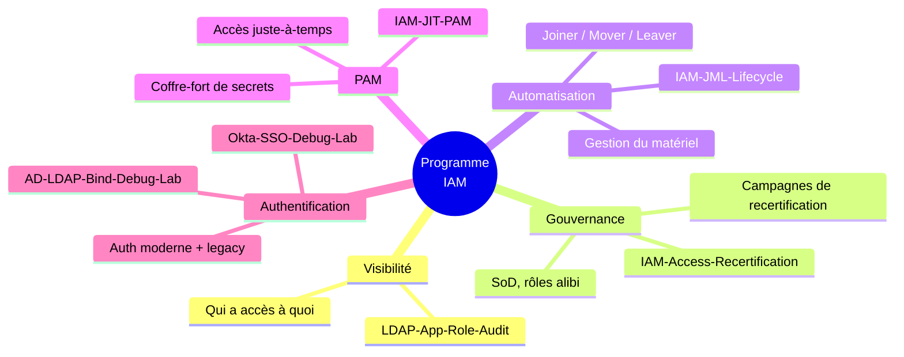
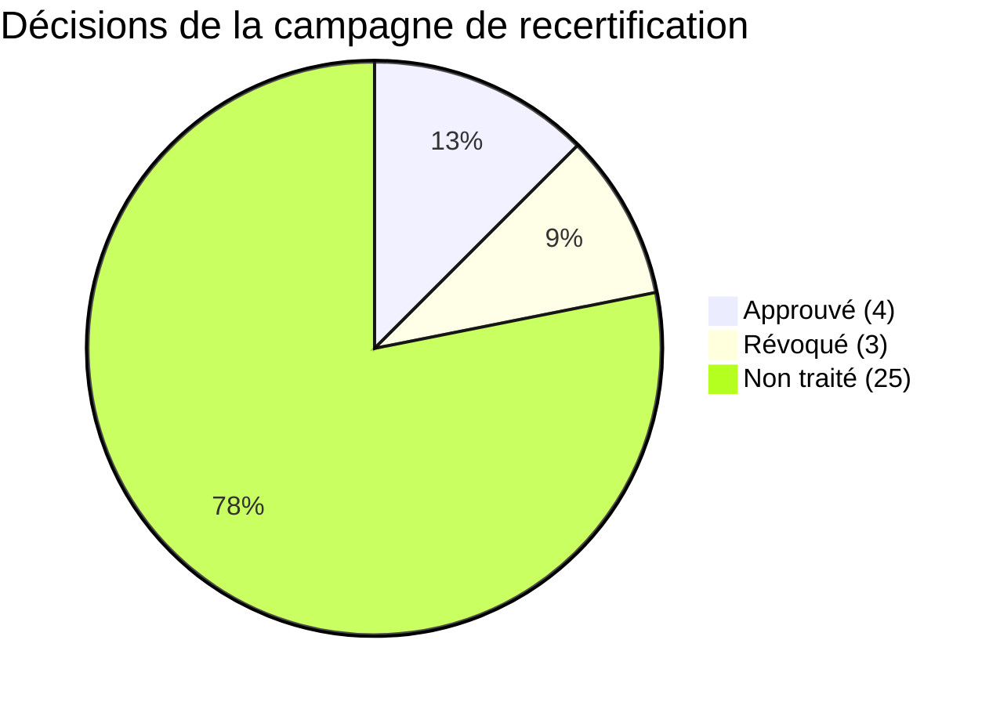

# 🧭 IAM Governance Roadmap

Le volet pilotage du portfolio IAM : comment un programme de gouvernance des accès se
construit et se pilote en entreprise, phase par phase — avec, pour chaque phase, l'outillage
technique réellement construit et testé pour la livrer (pas une maquette théorique).

## 📋 Résumé exécutif

Sans gouvernance IAM structurée, une organisation accumule des accès non maîtrisés : personne
ne sait avec certitude qui a accès à quoi, les cumuls d'accès incompatibles (séparation des
tâches) passent inaperçus jusqu'à un audit, et le départ ou le changement de poste d'un
collaborateur ne se traduit pas systématiquement par la révocation de ses accès. C'est un
risque de sécurité, un point de non-conformité récurrent en audit, et une charge manuelle
croissante pour l'IT.

Ce programme referme cette boucle en 5 phases : **savoir** qui a accès à quoi, **décider** ce
qui doit changer, **exécuter** ce changement automatiquement, **maîtriser dans le temps** les
accès à privilège, et **fiabiliser** la porte d'entrée (authentification) sur laquelle tout le
reste s'appuie.

## 🗺️ Vue d'ensemble

## 🛣️ Roadmap en phases

| Phase | Objectif | Livrable technique | Sortie de phase |
|---|---|---|---|
| **0. Cadrage** | Obtenir un sponsor (RSSI/DSI), définir le périmètre pilote, formaliser les premières règles SoD avec le métier | — | Sponsor identifié, périmètre pilote validé, 1ère règle SoD écrite avec un propriétaire d'application |
| **1. Visibilité** | Savoir qui a accès à quoi, sans supposition | [LDAP-App-Role-Audit](https://github.com/Anne-LaureS/LDAP-App-Role-Audit) | Export d'audit couvrant 100% du périmètre pilote |
| **2. Gouvernance** | Détecter les cumuls à risque, nettoyer les rôles inutilisés, faire arbitrer les propriétaires d'accès | [IAM-Access-Recertification](https://github.com/Anne-LaureS/IAM-Access-Recertification) | 1ère campagne de recertification bouclée, violations SoD ramenées à zéro sur le pilote |
| **3. Automatisation** | Ne plus dépendre d'une action manuelle pour créer, modifier ou couper un accès | [IAM-JML-Lifecycle](https://github.com/Anne-LaureS/IAM-JML-Lifecycle) | Cycle Joiner/Mover/Leaver exécuté sans intervention manuelle sur le périmètre pilote |
| **4. PAM** | Maîtriser les accès à privilège dans la durée (accès temporaire) et les secrets partagés (stockage, rotation) | [IAM-JIT-PAM](https://github.com/Anne-LaureS/IAM-JIT-PAM) | Accès juste-à-temps opérationnel + au moins un secret de compte de service géré (stocké, retiré, tourné) sur le périmètre pilote |
| **5. Authentification** | Fiabiliser et documenter le diagnostic de la porte d'entrée, moderne et legacy | [Okta-SSO-Debug-Lab](https://github.com/Anne-LaureS/Okta-SSO-Debug-Lab), [AD-LDAP-Bind-Debug-Lab](https://github.com/Anne-LaureS/AD-LDAP-Bind-Debug-Lab) | Runbooks de debug adoptés par le support N2, temps de résolution d'incident d'auth réduit |
| **6. Pilotage continu** | Maintenir la gouvernance dans la durée, pas juste au lancement | Comité de pilotage + KPIs (voir plus bas) | Cycle de recertification récurrent, KPIs suivis en continu |

Les phases 1 à 3 sont séquentielles (chacune dépend des données produites par la précédente) ;
les phases 4 et 5 sont mobilisables en parallèle dès le cadrage, puisqu'elles ne dépendent pas
de l'audit d'accès.

## 👥 Gouvernance du programme

**RACI simplifié :**

| Rôle | Responsabilité |
|---|---|
| RSSI / Responsable DSI (Sponsor) | Arbitrage final, priorisation, déblocage des ressources |
| Chef de projet IAM | Pilotage du planning, animation du comité, reporting KPIs |
| Propriétaires d'application | Décision Approve/Revoke en campagne de recertification, validation des règles SoD de leur périmètre |
| Équipe IAM | Exécution technique (audit, campagnes, JML, debug auth) |
| Audit / Conformité | Contrôle indépendant, exploitation des KPIs pour les constats d'audit |

**Comité de pilotage** — cadence mensuelle recommandée. Ordre du jour type : avancement de
phase, KPIs du mois, campagnes de recertification en cours et à venir, incidents
d'authentification notables, décisions à arbitrer (ex: nouvelle règle SoD proposée).

## 📊 Indicateurs (KPIs)

| Indicateur | Source |
|---|---|
| Nombre de violations SoD détectées / résolues | `SoD_Violations.csv` (IAM-Access-Recertification), suivi d'une campagne à l'autre |
| Nombre de rôles "alibi" identifiés / nettoyés | `Alibi_Roles_Candidates.csv` (IAM-Access-Recertification) |
| Taux de complétion d'une campagne de recertification | Lignes traitées (Approve/Revoke) ÷ total, dans le résumé de `Complete-CertificationCampaign.ps1` |
| Volume d'accès révoqués par campagne | `Remediation_Actions.csv` (IAM-Access-Recertification) |
| Volume de Joiners/Movers/Leavers traités, taux de succès | `JML_Run_Report.csv` (IAM-JML-Lifecycle) |
| Nombre d'accès à privilège actifs / expirés, durée moyenne accordée | `JIT_Access_Ledger.csv` (IAM-JIT-PAM) |
| Nombre de retraits de secrets, fréquence de rotation | `Vault_Checkout_Ledger.csv`, `LastRotated` dans `Vault.json` (IAM-JIT-PAM) |
| Couverture des scénarios de panne d'authentification documentés | Nombre de scénarios du runbook (`procedure-debug-bind.md`, `procedure-debug-sso.md`) effectivement adoptés par le support |

**Snapshot du pilote** — un seul cycle exécuté à ce stade, donc un instantané, pas encore une
tendance dans le temps :

Répartition de la campagne pilote (32 lignes) :

## ⚠️ Risques & dépendances

- **Qualité des données sources** : l'audit (phase 1) ne vaut que ce que vaut l'annuaire — un
  schéma LDAP mal documenté ou incohérent (rencontré réellement lors du branchement AD dans
  LDAP-App-Role-Audit) retarde toute la suite.
- **Adoption par les propriétaires d'application** : une campagne de recertification sans
  réponse des propriétaires (`Decision` resté vide) ne produit aucune remédiation — la
  gouvernance dépend de leur engagement, pas seulement de l'outillage.
- **Dérive du périmètre "de test" vers la production** : les comptes/règles de démonstration
  doivent rester cloisonnés (leçon directement tirée d'IAM-JML-Lifecycle et
  AD-LDAP-Bind-Debug-Lab, où mélanger comptes de test et comptes réels a été une source
  d'erreurs concrètes pendant les phases pilotes).
- **Disponibilité du support N2** pour s'approprier les runbooks d'authentification — un
  runbook non adopté n'accélère aucune résolution d'incident.

---

Le détail technique de chaque phase (scripts, tests réels, bugs trouvés et corrigés) vit dans
le README de son repo respectif — ce document reste au niveau pilotage.
